# Experiment05-Docker

## بررسی پروژه و تکنولوژی استفاده شده

برای پیاده‌سازی این سرویس backend از فریم‌ورک جنگو که مبتنی بر زبان برنامه‌نویسی پایتون است، استفاده شده است.
به دلیل سرعت و سادگی در استفاده، ما از این فریم‌ورک برای انجام پروژه استفاده کردیم.

در این پروژه، بک‌اند یک وبلاگ تستی و ساده را مورد بررسی قرار دادیم. برای آن ۲ مدل به نام‌های `Author` و `Blog` تعریف کرده‌ایم که ساختار و اتریبیوت‌های آن‌های را در زیر مشاهده می‌کنید:

```python
class Author(models.Model):
    full_name = models.CharField(max_length=255, null=False, blank=True)
    description = models.CharField(max_length=255, null=False, blank=True)
    age = models.PositiveIntegerField()
    github = models.URLField()
    linkedin = models.URLField()
    email = models.EmailField()

    def __str__(self):
        return f"{self.full_name} - {self.description}"


class Blog(models.Model):
    author = models.ForeignKey(Author, related_name='blogs', on_delete=models.CASCADE)
    markdown = models.TextField()
    title = models.CharField(blank=False, null=False, max_length=255)
    created_at = models.DateTimeField(auto_now_add=True)
    is_active = models.BooleanField(default=True)

    def __str__(self):
        return f"{self.author.full_name} - {self.title}"
```

رابطه‌ی بین این دو مدل به صورت یک به چند است زیرا که یک نویسنده می‌تواند چندین بلاگ نوشته باشد اما یک بلاگ را فقط یک نفر نوشته است.


باز هم به دلیل سادگی و سرعت پیاده‌سازی، ما از کتابخانه‌ی `DjangoRestFramework`
استفاده کردیم تا `API`ها را با ساعت و تعداد خط کد کمتری پیاده‌سازی کنیم.

## جزئیات API ها

برای ساخت `API`ها از کلاس 
`generics`
که داخل کتابخانه 
`DjangoRestFramework`
استفاده کردیم.

لیست `View`های موجود در پروژه در ادمه قابل مشاهده است:

```python
class AuthorListCreate(generics.ListCreateAPIView):
    queryset = Author.objects.all()
    serializer_class = AuthorSerializer

class AuthorDetail(generics.RetrieveUpdateDestroyAPIView):
    queryset = Author.objects.all()
    serializer_class = AuthorSerializer

class BlogListCreate(generics.ListCreateAPIView):
    queryset = Blog.objects.all()
    serializer_class = BlogSerializer

class BlogDetail(generics.RetrieveUpdateDestroyAPIView):
    queryset = Blog.objects.all()
    serializer_class = BlogSerializer

class AuthorReadAll(generics.ListAPIView):
    queryset = Author.objects.all()
    serializer_class = AuthorSerializer

class BlogReadAll(generics.ListAPIView):
    queryset = Blog.objects.all()
    serializer_class = BlogSerializer
```

همچنین برای ۲ مدل خود سریالایزر هم نوشتیم تا فقط اتریبیوت‌های مورد نظر ما در `API`ها
برگردانده شوند:

```python
class AuthorSerializer(serializers.ModelSerializer):
    class Meta:
        model = Author
        fields = ['id', 'full_name', 'age', 'description', 'github', 'linkedin', 'email']

class BlogSerializer(serializers.ModelSerializer):
    author = AuthorSerializer()

    class Meta:
        model = Blog
        fields = ['id', 'author', 'markdown', 'title', 'created_at', 'is_active']
```

همچنین `URL` هر کدام از `View`
ها را مطابق ساختار زیر مشخص کردیم و برای هر کدام یک نام هم اختصاص دادیم:

```python
urlpatterns = [
    path('authors/', blog_views.AuthorListCreate.as_view(), name='author-list-create'),
    path('authors/<int:pk>/', blog_views.AuthorDetail.as_view(), name='author-detail'),
    path('authors/readall/', blog_views.AuthorReadAll.as_view(), name='author-readall'),

    path('blogs/', blog_views.BlogListCreate.as_view(), name='blog-list-create'),
    path('blogs/<int:pk>/', blog_views.BlogDetail.as_view(), name='blog-detail'),
    path('blogs/readall/', blog_views.BlogReadAll.as_view(), name='blog-readall'),
]
```

## بررسی داکرفایل پروژه backend

داکرفایل نوشته شده برای پروژه backend به صورت زیر است:

```dockerfile
FROM docker.arvancloud.ir/python:3.13

WORKDIR /app

COPY . .

RUN python -m pip install -i https://mirror-pypi.runflare.com/simple --upgrade pip

RUN pip install -i https://mirror-pypi.runflare.com/simple -r requirements.txt

EXPOSE 8000

CMD ["python", "manage.py", "runserver", "0.0.0.0:8000"]
```

توضیح داکرفایل:

این داکرفایل برای ساخت یک تصویر داکر برای پروژه Django استفاده می‌شود. در اینجا مراحل مختلفی که در داکرفایل انجام می‌شود توضیح داده شده است:

1. **انتخاب تصویر پایه**: در خط اول، یک تصویر پایه از Python 3.13 انتخاب می‌شود که از مخزن ArvanCloud بارگیری می‌شود.

2. **تنظیم دایرکتوری کاری**: با استفاده از دستور `WORKDIR /app`، دایرکتوری کاری به `/app` تغییر می‌کند. این بدان معناست که تمام دستورات بعدی در این دایرکتوری اجرا خواهند شد.

3. **کپی فایل‌ها**: با استفاده از دستور `COPY . .`، تمام فایل‌های موجود در دایرکتوری فعلی به دایرکتوری کاری در تصویر داکر کپی می‌شوند.

4. **نصب pip**: در این مرحله، pip به‌روز می‌شود تا از آخرین نسخه آن استفاده شود.

5. **نصب وابستگی‌ها**: با استفاده از دستور `RUN pip install -i https://mirror-pypi.runflare.com/simple -r requirements.txt`، تمام وابستگی‌های پروژه که در فایل `requirements.txt` مشخص شده‌اند، نصب می‌شوند.

6. **باز کردن پورت**: با استفاده از دستور `EXPOSE 8000`، پورت 8000 برای دسترسی به برنامه در حال اجرا باز می‌شود.

7. **اجرای سرور**: در نهایت، با استفاده از دستور `CMD ["python", "manage.py", "runserver", "0.0.0.0:8000"]`، سرور Django در آدرس `0.0.0.0:8000` راه‌اندازی می‌شود.


**به دلیل محدودیت‌های اینترنتی، از یک mirror داخلی برای نصب وابستگی‌های پروژه استفاده شده‌است!**

## پیاده‌سازی load balancer

چون در ادامه نیاز داریم تا چند اینستنس از اپلیکیشن Django را مدیریت کنیم، از Nginx به عنوان لود بالانسر استفاده می‌کنیم. برای این کار، باید Nginx را پیکربندی کنیم.

در فولدر `nginx` یک فایل جدید به نام `nginx.conf` ایجاد کردیم و تنظیمات زیر را در آن قرار دادیم:

```nginx
events {}

http {
    upstream backend_pool {

        server backend1:8000 max_fails=3 fail_timeout=30s weight=1;
        server backend2:8000 max_fails=3 fail_timeout=30s weight=1;
        server backend3:8000 max_fails=3 fail_timeout=30s weight=1;

    }

    server {
        listen 80;

        location / {
            proxy_pass http://backend_pool;

            proxy_set_header Host $host;
            proxy_set_header X-Real-IP $remote_addr;
            proxy_set_header X-Forwarded-For $proxy_add_x_forwarded_for;
            proxy_set_header X-Forwarded-Proto $scheme;
            proxy_set_header X-Forwarded-Host $server_name;

        }
    }
}
```

توضیح:

1. **events {}**

   - بخش مربوط به تنظیمات رویدادها و کار با کانکشن‌ها. در اینجا خالی است و از تنظیمات پیش‌فرض استفاده می‌کند.

2. **http { … }**

   - بخش اصلی برای تنظیمات HTTP در NGINX. شامل تعریف upstream و server.

3. **upstream backend_pool { … }**

   - تعریف یک **گروه سرور** (Load Balancing Pool) به نام `backend_pool`.
   - سه سرور backend اضافه شده‌اند: `backend1`, `backend2`, `backend3` هر کدام روی پورت ۸۰۰۰.
   - `max_fails=3 fail_timeout=30s`: اگر یک سرور سه بار متوالی fail کند، به مدت ۳۰ ثانیه از دسترس خارج در نظر گرفته می‌شود.
   - `weight=1`: وزن سرور برای Load Balancing (در اینجا همه مساوی هستند).

4. **server { … }**

   - تعریف یک Virtual Host که به پورت ۸۰ گوش می‌دهد.

5. **location / { … }**

   - درخواست‌های مسیر `/` به `backend_pool` هدایت می‌شوند.
   - `proxy_pass http://backend_pool;`: درخواست‌ها به سرورهای backend ارسال می‌شوند.
   - `proxy_set_header …`: اضافه کردن هدرهایی به درخواست‌های پراکسی برای حفظ اطلاعات اصلی کلاینت و دامنه.

     - `Host`: نام میزبان اصلی
     - `X-Real-IP`: آی‌پی واقعی کلاینت
     - `X-Forwarded-For`: لیست آی‌پی‌های پراکسی شده
     - `X-Forwarded-Proto`: پروتکل اصلی (http/https)
     - `X-Forwarded-Host`: نام سرور NGINX

## پیاده‌سازی Docker-Compose

برای ساده‌تر کردن مدیریت کانتینرها و سرویس‌ها، از Docker-Compose استفاده می‌کنیم. با استفاده از یک فایل `docker-compose.yml` می‌توانیم تمام سرویس‌ها، شبکه‌ها و حجم‌های مورد نیاز را به راحتی تعریف و راه‌اندازی کنیم.

### ایجاد فایل docker-compose.yml

در ریشه پروژه، یک فایل به نام `docker-compose.yml` ایجاد می‌کنیم و تنظیمات زیر را در آن قرار می‌دهیم:

```yaml
version: "3.8"

services:
  backend1:
    build: ./backend
    container_name: backend1
    environment:
      - DJANGO_SECRET_KEY=${DJANGO_SECRET_KEY:-dev-secret}
      - DJANGO_DEBUG=${DJANGO_DEBUG:-1}
      - DB_NAME=${DB_NAME:-app}
      - DB_USER=${DB_USER:-app}
      - DB_PASSWORD=${DB_PASSWORD:-app}
      - DB_HOST=${DB_HOST:-db}
      - DB_PORT=${DB_PORT:-5432}
    depends_on:
      - db

  backend2:
    build: ./backend
    container_name: backend2
    environment:
      - DJANGO_SECRET_KEY=${DJANGO_SECRET_KEY:-dev-secret}
      - DJANGO_DEBUG=${DJANGO_DEBUG:-1}
      - DB_NAME=${DB_NAME:-app}
      - DB_USER=${DB_USER:-app}
      - DB_PASSWORD=${DB_PASSWORD:-app}
      - DB_HOST=${DB_HOST:-db}
      - DB_PORT=${DB_PORT:-5432}
    depends_on:
      - db

  backend3:
    build: ./backend
    container_name: backend3
    environment:
      - DJANGO_SECRET_KEY=${DJANGO_SECRET_KEY:-dev-secret}
      - DJANGO_DEBUG=${DJANGO_DEBUG:-1}
      - DB_NAME=${DB_NAME:-app}
      - DB_USER=${DB_USER:-app}
      - DB_PASSWORD=${DB_PASSWORD:-app}
      - DB_HOST=${DB_HOST:-db}
      - DB_PORT=${DB_PORT:-5432}
    depends_on:
      - db

  db:
    image: postgres:16-alpine
    environment:
      - POSTGRES_DB=${DB_NAME:-app}
      - POSTGRES_USER=${DB_USER:-app}
      - POSTGRES_PASSWORD=${DB_PASSWORD:-app}
    volumes:
      - pgdata:/var/lib/postgresql/data

  nginx:
    image: nginx:alpine
    ports:
      - "80:80"
    volumes:
      - ./nginx/nginx.conf:/etc/nginx/nginx.conf:ro
    depends_on:
      - backend1
      - backend2
      - backend3

volumes:
  pgdata:
```

### توضیح فایل docker-compose.yml

این **Docker Compose** یک محیط شامل سه بخش اصلی ایجاد می‌کند: چند backend، دیتابیس و NGINX. به طور خلاصه:

1. **نسخه Compose:**

   - `version: "3.8"` برای سازگاری با ویژگی‌های جدید Docker Compose.

2. **سرویس‌ها (services):**

   - **backend1, backend2, backend3:**

     - هر سه سرویس از همان مسیر `./backend` ساخته می‌شوند.
     - متغیرهای محیطی برای Django و اتصال به PostgreSQL تعریف شده‌اند (`DJANGO_SECRET_KEY`, `DB_NAME`, `DB_USER` و …).
     - `depends_on: db`: قبل از اجرای backend، دیتابیس باید آماده باشد.
     - در واقع این سه سرویس یک **کلاستر ساده Django** هستند که پشت NGINX قرار می‌گیرند.

   - **db:**

     - یک کانتینر PostgreSQL نسخه 16 با تصویر سبک `alpine`.
     - دیتابیس و یوزر/پسورد طبق متغیرهای محیطی تنظیم شده است.
     - داده‌ها در volume `pgdata` ذخیره می‌شوند تا با حذف کانتینر، اطلاعات از بین نروند.

   - **nginx:**

     - کانتینر NGINX با تصویر سبک `alpine`.
     - پورت ۸۰ میزبان به پورت ۸۰ کانتینر متصل شده.
     - کانفیگ NGINX از فایل محلی `./nginx/nginx.conf` بارگذاری می‌شود.
     - `depends_on` روی سه backend: قبل از اجرای NGINX، backendها آماده باشند.

3. **volumes:**

   - `pgdata`: ذخیره‌سازی پایدار برای دیتابیس PostgreSQL.

## اجرا

در ابتدا از دستور زیر استفاده می‌کنیم:

```bash
docker compose build
```

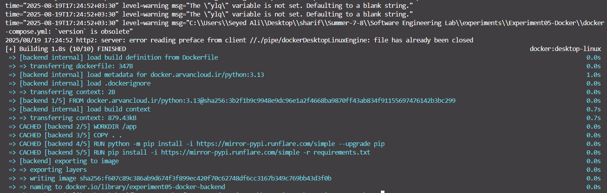

این دستور **تصاویر (images) تمام سرویس‌های تعریف شده در فایل `docker-compose.yml` را می‌سازد**.

- برای سرویس‌هایی که `build:` دارند، Docker مسیر مشخص‌شده را خوانده و Dockerfile را اجرا می‌کند تا image بسازد.
- اگر image قبلاً ساخته شده باشد، فقط بخش‌هایی که تغییر کرده‌اند دوباره ساخته می‌شوند.

در ادامه دستور زیر را وارد می‌کنیم:

```bash
docker compose up -d db
```

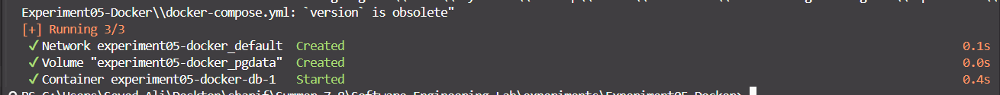

این دستور **کانتینر دیتابیس را در پس‌زمینه راه‌اندازی می‌کند.** در این مرحله، فقط دیتابیس راه‌اندازی می‌شود و backendها هنوز در حال اجرا نیستند. علت اینکه ابتدا قبل از راه‌اندازی backend‌ها دیتابیس را راه‌اندازی می‌کنیم این است که backendها برای اتصال و شروع دریافت درخواست به دیتابیس (migrate) نیاز دارند و باید مطمئن شویم که دیتابیس آماده است.

در ادامه این کامند را اجرا می‌کنیم:

```bash
docker compose run --rm backend1 python manage.py migrate
```

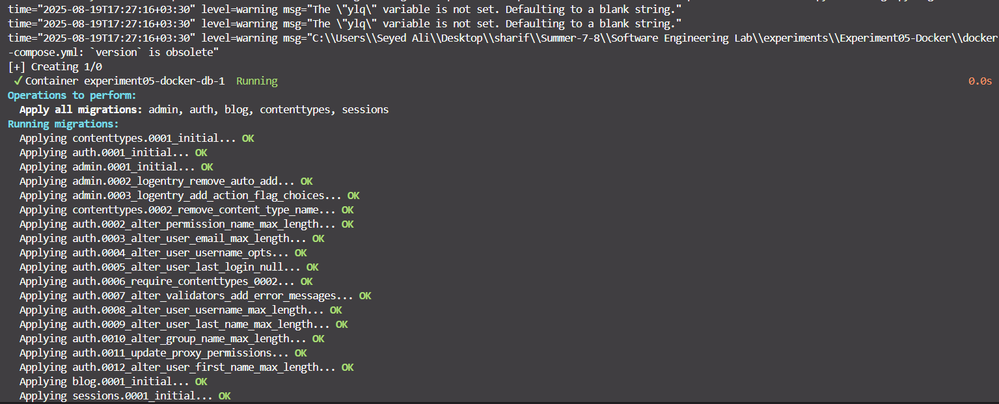

این دستور یک کانتینر موقت از سرویس backend1 اجرا می‌کند و داخل آن دستور python manage.py migrate را اجرا می‌کند تا تغییرات مایگریشن‌های جنگو روی دیتابیس اعمال شود. به دلیل استفاده از گزینه --rm این کانتینر بعد از پایان کار حذف می‌شود.

از آن‌جا که همه سرویس‌های backend1 و backend2 و backend3 به یک دیتابیس مشترک متصل هستند، اعمال مایگریشن روی یکی از آن‌ها کافی است و دیتابیس برای همه به‌روزرسانی می‌شود، بنابراین لازم نیست همان دستور را برای backendهای دیگر اجرا کنیم.

در نهایت این کامند را اجرا می‌کنیم:

```bash
docker compose up -d
```

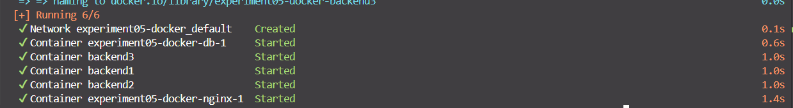

این دستور همه سرویس‌های تعریف شده در فایل docker-compose.yml را اجرا می‌کند و به خاطر گزینه -d کانتینرها در پس‌زمینه بالا می‌آیند تا ترمینال آزاد بماند.

طبق خواسته دستورکار برای اطمینان از راه‌اندازی شدن سرویس‌ها، دستور زیر را اجرا می‌کنیم:

```bash
docker container ls
```

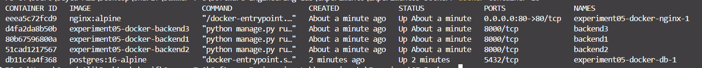

این دستور لیست کانتینرهای در حال اجرا را نمایش می‌دهد.

همچنین برای اطمینان از ایجاد درست image‌ها از دستور زیر استفاده می‌کنیم:

```bash
docker image ls
```

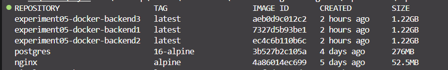

این دستور لیست image‌های موجود در سیستم را نمایش می‌دهد.

نمای گرافیکی سرویس‌های در حال اجرا در نرم‌افزار docker desktop نیز قابل مشاهده است:

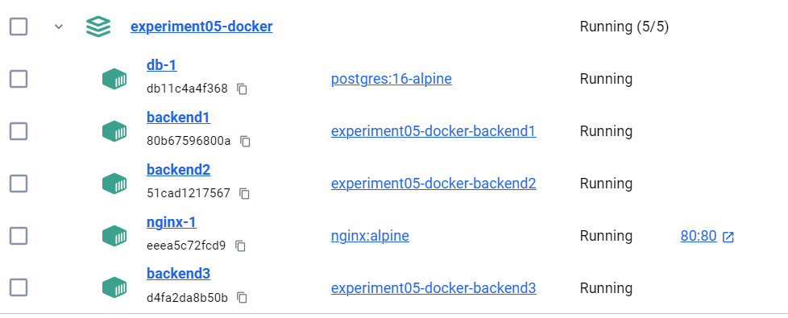

## تست صحت کلی برنامه

در این قسمت، همانطور که در تنظیمات Nginx هم مشخص است، باید بتوان از طریق آدرس http://localhost/ به صفحه اصلی پروژه دسترسی پیدا کرد. برای این کار در اینجا از خود مرورگر استفاده کردیم.

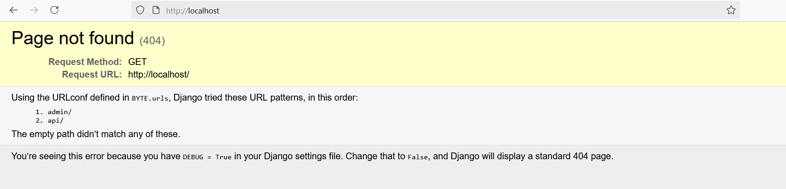

همانطور که مشاهده می‌شود، صفحه اصلی پروژه با آدرس تعیین شده، به درستی بارگذاری شده است.

برای تست بیشتر یک Api تست برای ساخت نویسنده جدید را به وسیله postman انجام دادیم.

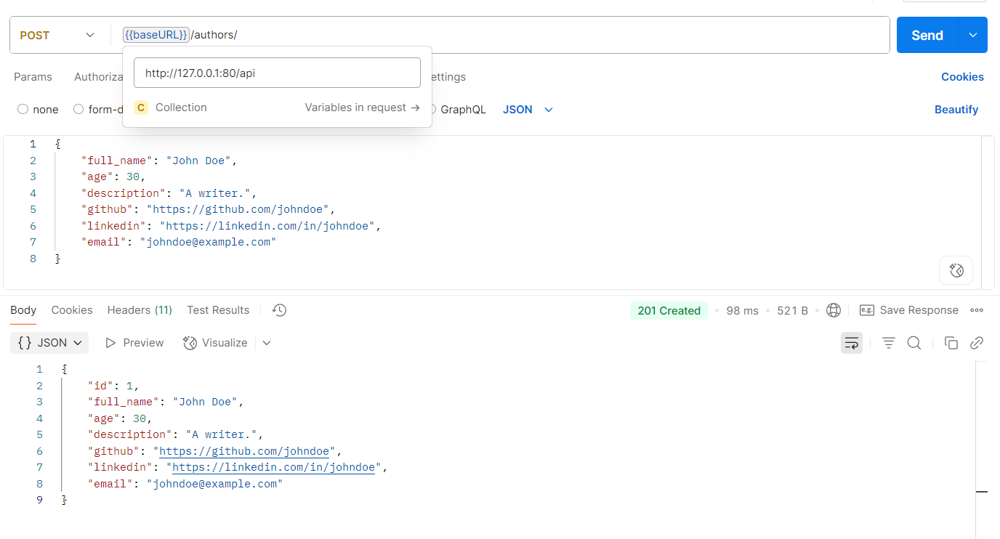

این بخش هم به درستی کار می‌کند و نویسنده جدید با موفقیت ایجاد می‌شود.

## تست Loadbalancing

با توجه به docker-compose.yml، سه سرویس backend داریم که به صورت همزمان در حال اجرا هستند. پخش متعادل درخواست‌ها به سرویس‌ها،‌ وظیفه سرویس Nginx است.

سرویس Nginx با توجه به کانفیگی که برای آن پیش‌تر توضیح دادیم، از الگوریتم round-robin برای توزیع بار استفاده می‌کند. این الگوریتم به صورت متناوب درخواست‌ها را به هر یک از سرویس‌های backend ارسال می‌کند.

برای اینکه متوجه صحت اجرای Loadbalancing شویم، می‌توانیم لاگ هرکدام از سرویس‌های backend را مشاهده کنیم، تا ببنیم هر درخواست را کدام یک از آنها پاسخ می‌دهند.

با استفاده از کامند زیر می‌توانیم لاگ سرویس backend1 را مشاهده کنیم:

```bash
docker compose logs -f backend1
```

(فلگ -f یعنی لاگ‌های سرویس backend به صورت زنده و پیوسته دنبال شوند.)

برای سایر سرویس‌های backend نیز به همین صورت می‌توان انجام داد.

در نهایت صفحه لاگ هر سه سرویس را به صورت زیر داریم:

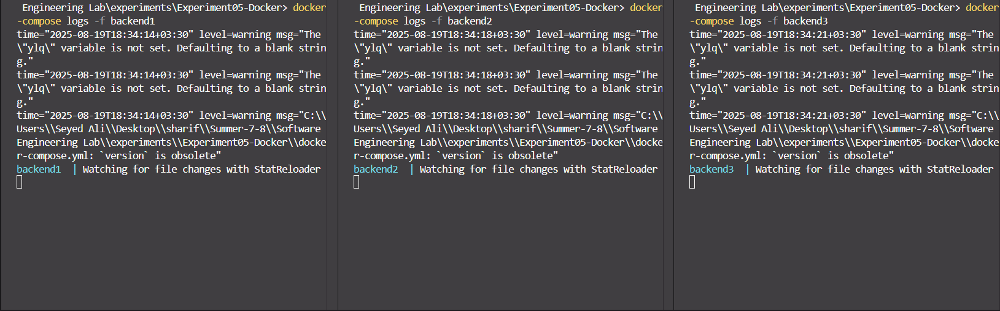

در اینجا درخواست اول را ارسال می‌کنیم:

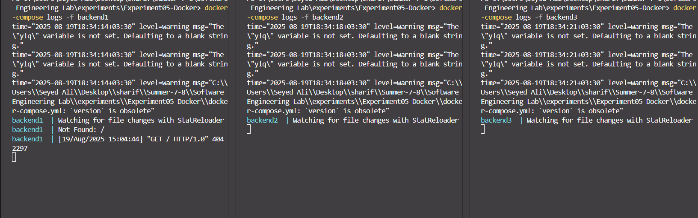

مشاهده می‌کنیم که درخواست به سرویس backend1 ارسال شده است.

سپس درخواست دوم را ارسال می‌کنیم:

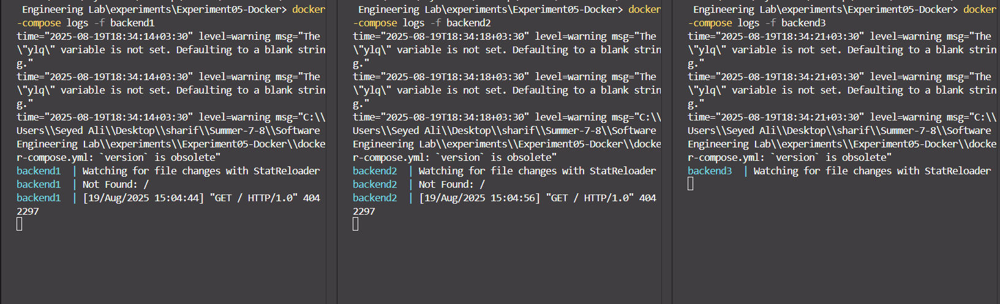

مشاهده می‌کنیم که درخواست به سرویس backend2 ارسال شده است.

و در نهایت درخواست سوم را ارسال می‌کنیم:

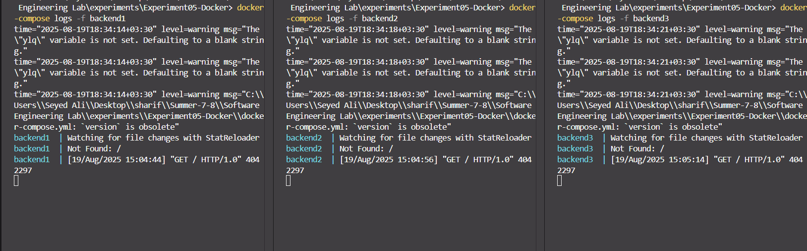

مشاهده می‌کنیم که درخواست به سرویس backend3 ارسال شده است.

پس از مشاهده توزیع بار به صورت متعادل بین سرویس‌های backend، می‌توانیم نتیجه بگیریم که Loadbalancing به درستی کار می‌کند.


v```markdown
# 📑 مستندات API نویسنده و وبلاگ

## نویسندگان (Authors)

### 1. ایجاد نویسنده جدید  
**Endpoint:**  
```

POST /authors/

````

**هدرها (Headers):**
```json
{
  "Content-Type": "application/json"
}
````

**نمونه بدنه درخواست (Request Body):**

```json
{
  "full_name": "John Doe",
  "age": 30,
  "description": "A writer.",
  "github": "https://github.com/johndoe",
  "linkedin": "https://linkedin.com/in/johndoe",
  "email": "johndoe@example.com"
}
```


### 2. دریافت لیست کامل نویسندگان

**Endpoint:**

```
GET /authors/readall/
```


### 3. دریافت نویسنده با شناسه (ID)

**Endpoint:**

```
GET /authors/{id}/
```

**مثال:**

```
GET /authors/1/
```


### 4. بروزرسانی نویسنده با شناسه (ID)

**Endpoint:**

```
PUT /authors/{id}/
```

**هدرها (Headers):**

```json
{
  "Content-Type": "application/json"
}
```

**نمونه بدنه درخواست (Request Body):**

```json
{
  "full_name": "John Doe Updated",
  "age": 31,
  "description": "Updated writer.",
  "github": "https://github.com/johndoeupdated",
  "linkedin": "https://linkedin.com/in/johndoeupdated",
  "email": "johndoeupdated@example.com"
}
```


### 5. حذف نویسنده با شناسه (ID)

**Endpoint:**

```
DELETE /authors/{id}/
```

**مثال:**

```
DELETE /authors/1/
```
---
## وبلاگ‌ها (Blogs)

### 1. ایجاد وبلاگ جدید

**Endpoint:**

```
POST /blogs/
```

**هدرها (Headers):**

```json
{
  "Content-Type": "application/json"
}
```

**نمونه بدنه درخواست (Request Body):**

```json
{
  "author": 1,
  "markdown": "# Blog Content",
  "title": "My First Blog",
  "is_active": true
}
```


### 2. دریافت لیست کامل وبلاگ‌ها

**Endpoint:**

```
GET /blogs/readall/
```


### 3. دریافت وبلاگ با شناسه (ID)

**Endpoint:**

```
GET /blogs/{id}/
```

**مثال:**

```
GET /blogs/1/
```


### 4. بروزرسانی وبلاگ با شناسه (ID)

**Endpoint:**

```
PUT /blogs/{id}/
```

**هدرها (Headers):**

```json
{
  "Content-Type": "application/json"
}
```

**نمونه بدنه درخواست (Request Body):**

```json
{
  "author": 1,
  "markdown": "# Updated Blog Content",
  "title": "Updated Blog",
  "is_active": false
}
```


### 5. حذف وبلاگ با شناسه (ID)

**Endpoint:**

```
DELETE /blogs/{id}/
```

**مثال:**

```
DELETE /blogs/1/
```
